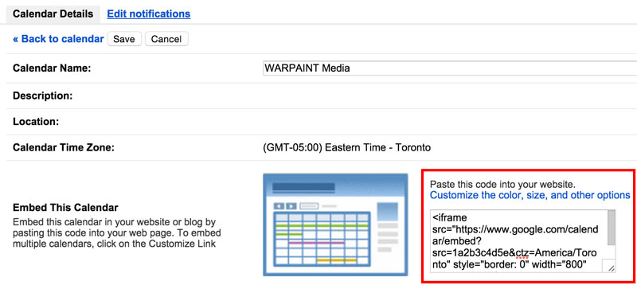

#Custom Google Calendar

###Apply a custom stylesheet to an embedded Google Calendar to match the rest of your site.

Embedding a Google Calendar to your site is easy to do but the lack of customization to an oudated theme makes it stick out like a sore thumb on a beautifully branded site.

###Instructions
Since you can't just inject a stylesheet into an iframe or overwrite the styles with an !important we have to go at it a different way...

#####First, find the link to your calendar
If you are the owner of the calendar, this can be found in your calendar details:


The code works like this:

#####Download a fresh copy of the calendar each time the page is requested
```php
$calendar = file_get_contents("https://www.google.com/calendar/embed?...")
```

#####Using a string replace, split the downloaded HTML right before `</head>` and add in the link to our own stylesheet
```php
$calendar = str_replace('</head>', '<link rel="stylesheet" href="../css/calendar.css"></head>', $calendar)
```

#####Save the updated file
```php
file_put_contents('calendar/calendar.html', $calendar)
```
If this step is not working, make sure you have the "write" permissions on the folder you are saving to

#####Render the saved file in an iframe
```html
<iframe src="calendar/calendar.html" frameborder="0" height="750"></iframe>
```
Make sure a height is specified or you won't see any events.

Alternatively, you could `echo $calendar` however, the HTML from Google has an `overflow: hidden` that gets added to `html` and `body` tags that prevents the rest of your page from scrolling. Rendering it in an iframe stops this from happening.

#####Theme away!
Now you can style the calendar to match the rest of your site.

Included is a theme we used for a client's calendar. It's set up in a way that you can just change the SCSS variables to suit but adjustments may be needed.

---

####Changelog

######0.0.1 - Initial commit
